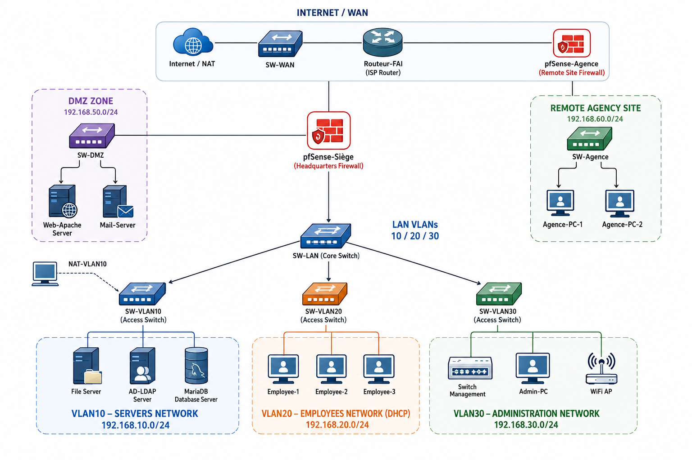

# Déploiement et Sécurisation d'une Infrastructure Réseau d'Entreprise

> **Mini-Projet 2** — Module Système | Cycle Ingénieur LSI2  
> Encadrant : **Pr. Boudhir Anouar Abdelhakim** — Département Génie Informatique, FST Tanger  
> Université Abdelmalek Essaâdi | Année universitaire 2025–2026

---



🎥 **[Regarder la vidéo de démonstration sur YouTube](https://youtu.be/7SLDNtFu9aE)**

---

## Contexte

Mise en place complète d'une infrastructure réseau sécurisée pour une PME de 80 employés répartis sur deux sites (siège + agence distante), simulée sous **GNS3**. Le projet couvre la conception, le déploiement et le durcissement de l'ensemble de l'infrastructure — du pare-feu périmétrique jusqu'aux mécanismes de surveillance et de réponse aux incidents.

---

## Architecture

```
Internet / WAN
      │
  Routeur-FAI
      │
 pfSense-Siège ──────────────── pfSense-Agence (VPN IPSec IKEv2)
      │                                │
  SW-LAN (trunk 802.1Q)           SW-Agence
      │                            192.168.60.0/24
  ┌───┼───────────────┐
  │   │               │
VLAN10          VLAN20          VLAN30          DMZ (192.168.50.0/24)
Serveurs        Employés        Admin           ├── Web-Apache (nginx)
192.168.10/24   192.168.20/24   192.168.30/24   └── Mail-Server (SMTP)
├── AD-LDAP
├── Fichiers
└── BDD-MariaDB
```

**Stack technique :** pfSense CE 2.8.1 · Debian 12 · OpenLDAP · Suricata 7 (IDS) · Docker (MariaDB, nginx, SMTP) · ELK 8.13 · fail2ban · rkhunter · AIDE

---

## Structure du dépôt

```
.
├── rapport/                        # Rapport technique complet
│   ├── rapport_mp2.pdf             # PDF compilé (livrable final)
│   ├── rapport_mp2.tex             # Source LaTeX
│   ├── screenshots/                # Captures d'écran (référencées dans le rapport)
│   └── real-results/               # Résultats réels des tests de sécurité
│
├── hardening/                      # Scripts de durcissement serveur
│   ├── harden_server.sh            # Script principal (AD-LDAP)
│   ├── harden_fichiers.sh          # Serveur fichiers (Samba/NFS)
│   ├── harden_web.sh               # Serveur web (nginx + Apache)
│   ├── harden_mail.sh              # Serveur mail (Postfix)
│   └── harden_continue_ldap.sh     # Suite configuration OpenLDAP
│
├── elk/                            # Stack ELK (centralisation des journaux)
│   ├── docker-compose.yml          # Elasticsearch + Logstash + Kibana 8.13
│   └── logstash/pipeline/
│       └── syslog.conf             # Pipeline syslog UDP + EVE JSON Suricata
│
├── infrastructure/                 # Scripts GNS3 (infrastructure-as-code)
│   ├── build_topology_mp2.py       # Construction de la topologie via API GNS3
│   ├── patch_topology_mp2.py       # Correctifs topologie
│   ├── patch_continue_mp2.py       # Suite des correctifs
│   └── setup_cloudinit_mp2.sh      # Configuration cloud-init des VMs Debian
│
└── livrables/                      # Livrables organisés selon le cahier des charges
    ├── 01_topologie_reseau/
    ├── 02_plan_adressage_IP/
    ├── 03_regles_parefeu_ACL/
    ├── 04_fichiers_configuration/
    ├── 05_tests_securite/
    ├── 06_script_automatisation/
    └── 07_demonstration_video/
```

---

## Livrables réalisés

| # | Livrable | Statut |
|---|----------|--------|
| 1 | Schéma topologie réseau (GNS3) | ✅ |
| 2 | Plan d'adressage IP complet | ✅ |
| 3 | Règles pare-feu et ACL pfSense | ✅ |
| 4 | Fichiers de configuration clés (`sshd_config`, `ufw`, `fail2ban`, `jail.local`…) | ✅ |
| 5 | Tests de sécurité : Nmap, brute-force SSH, tunnel VPN | ✅ |
| 6 | Script d'automatisation du durcissement *(bonus)* | ✅ |
| 7 | Stack ELK — centralisation et visualisation des journaux *(bonus)* | ✅ |

---

## Parties du projet

### Partie 1 — Conception de la topologie réseau
Topologie multi-zones avec pfSense comme point de filtrage central, segmentation en 3 VLANs (serveurs/employés/admin), DMZ isolée, tunnel VPN IPSec IKEv2 site-à-site.

### Partie 2 — Sécurisation du réseau
Politique *deny-all* par défaut sur pfSense, règles explicites par flux, IDS Suricata sur LAN+WAN avec règles ETOpen (Emerging Threats), VPN AES-256/SHA-256/MODP-2048.

### Partie 3 — Sécurisation des serveurs Linux
SSH sur port 2222 + MFA TOTP (Google Authenticator) + clé ED25519, UFW avec règles minimales, durcissement Apache/MariaDB, désactivation des services inutiles, synchronisation NTP.

### Partie 4 — Gestion des identités et des accès (IAM)
OpenLDAP avec 4 UOs (Direction/RH/IT/Commercial), politique de mots de passe via `pam_pwquality` (12 car., complexité, historique), MFA SSH (publickey + TOTP), sudo granulaire par groupe.

### Partie 5 — Surveillance, journalisation et réponse aux incidents
rsyslog centralisé, fail2ban (SSH/HTTP/mail — 5 tentatives max, ban 24h), rkhunter + AIDE (scan hebdomadaire), sauvegardes chiffrées GPG AES-256, PRA documenté. Stack ELK (bonus) : 400+ événements indexés en temps réel incluant les alertes Suricata.

---

## Reproduire l'environnement

**Prérequis :** GNS3 2.2+, Python 3.x, Docker, pfSense CE 2.8.1 ISO, Debian 12 cloud image.

```bash
# 1. Construire la topologie GNS3
python3 infrastructure/build_topology_mp2.py

# 2. Configurer les VMs Debian (cloud-init)
bash infrastructure/setup_cloudinit_mp2.sh

# 3. Durcir les serveurs (exécuter sur chaque VM)
bash hardening/harden_server.sh      # AD-LDAP
bash hardening/harden_fichiers.sh    # Serveur fichiers

# 4. Déployer la stack ELK sur la machine hôte
cd elk && docker compose up -d
```

---

## Équipe

| Nom | GitHub |
|-----|--------|
| El Gorrim Mohamed | [@MedGm](https://github.com/MedGm) |
| Kchibal Ismail | [@ismail745](https://github.com/ismail745) |
| Junaid Uthman | [@JunaidUthman](https://github.com/JunaidUthman) |
